# Game Lab screenshot gallery

Browse the latest reviewed screenshots for all 14 games in this branch. Click an
image to inspect it at full size. Most images come directly from the game's
versioned visual-test baselines, so the gallery follows baseline updates without
duplicating images. Some show just the playing surface; others include controls.

On GitHub, the branch selector controls which version you see: `main` shows the
published source, while a review branch shows its proposed changes. These are
desktop Chromium captures, including simulated phone layouts, rather than
photographs from physical iPhones or iPads. Linux baselines are shown where
available; shared baselines and the saved Arena Pong capture are identified below.

[Sumo Bumpers](#sumo-bumpers) · [Light-cycle Arena](#light-cycle-arena) ·
[Spaceship Panic](#spaceship-panic) · [Co-op Breakout](#co-op-breakout) ·
[Pong](#pong) · [Arena Pong](#arena-pong) · [Reaction Race](#reaction-race) ·
[Shared Lights](#shared-lights) · [Midnight Bakery](#midnight-bakery) ·
[Meteor Minigolf](#meteor-minigolf) · [Treasure Dive](#treasure-dive) ·
[Patchwork Picnic](#patchwork-picnic) · [Light Seek](#light-seek) ·
[Glow Clash](#glow-clash)

## Sumo Bumpers

Arena · shared baseline.

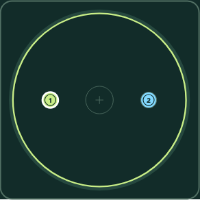

## Light-cycle Arena

Arena · shared baseline.

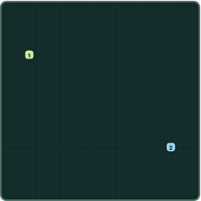

## Spaceship Panic

Active mission · phone layout.

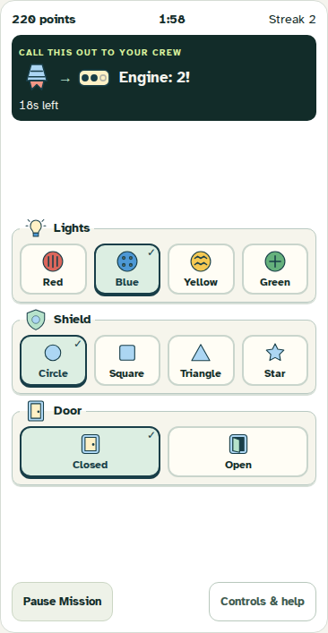

Success feedback and mission results

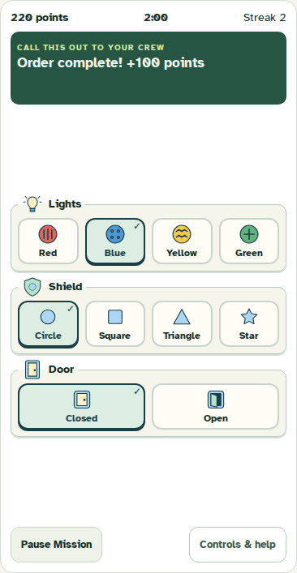

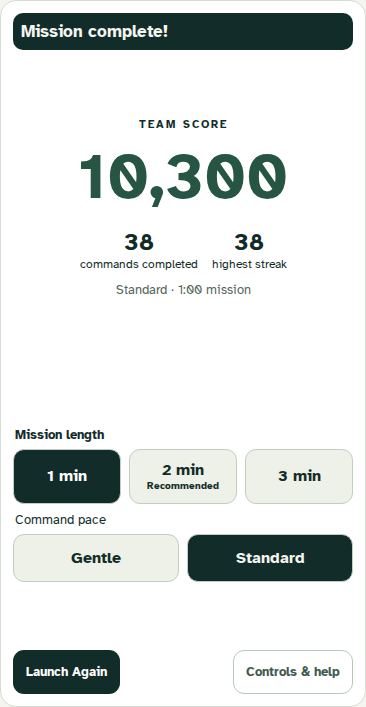

[All panel sets and states](tests/ship.spec.ts-snapshots/)

## Co-op Breakout

Playing surface · shared baseline.

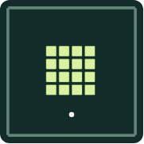

## Pong

Bumper warning · phone layout.

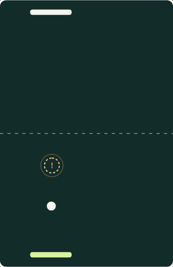

Four bumpers and impact feedback

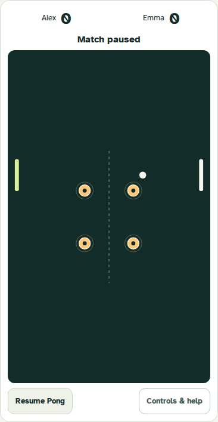

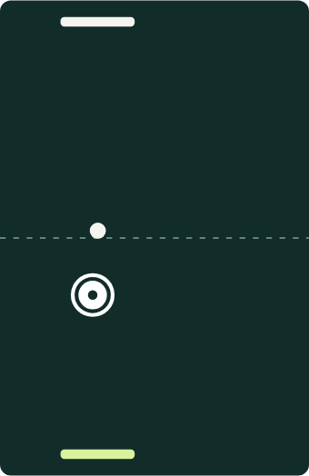

[All Pong states](tests/pong.spec.ts-snapshots/)

## Arena Pong

Four-player match, paused · desktop layout. Saved macOS capture from the existing
four-player pairing test; this is evidence, not a visual comparison baseline.

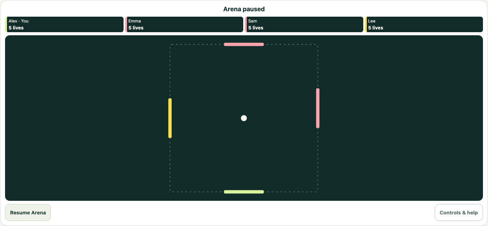

## Reaction Race

Targets · shared baseline.

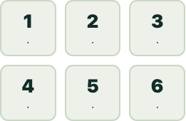

## Shared Lights

Shared board · shared baseline.

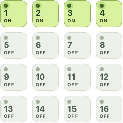

## Midnight Bakery

Player's hand · phone layout.

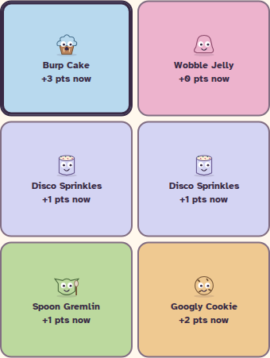

## Meteor Minigolf

Mixed course · desktop playing surface.

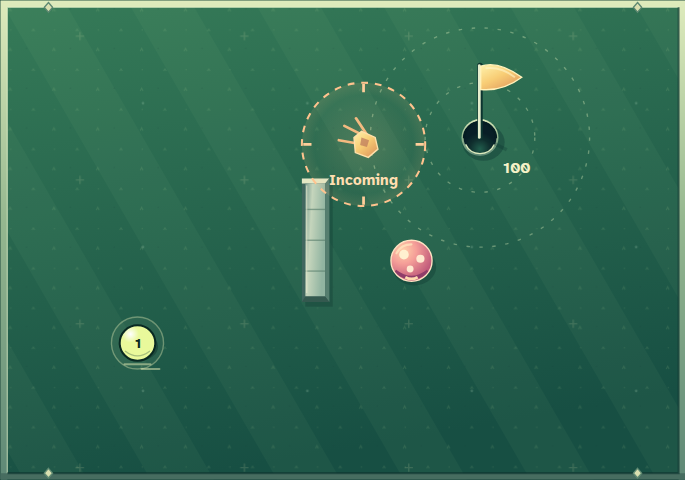

Phone controls, courses and results

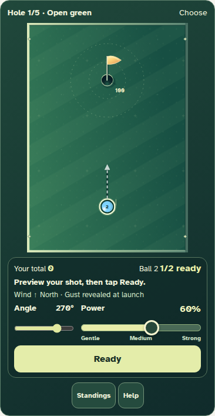

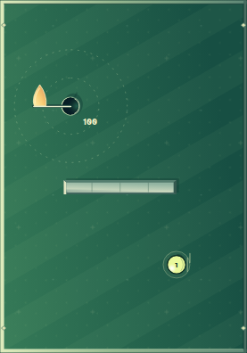

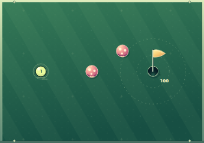

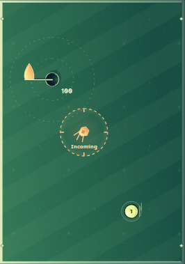

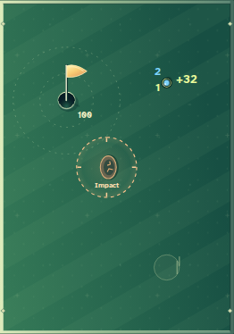

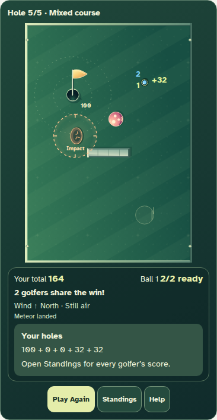

[All courses and states](tests/minigolf.spec.ts-snapshots/)

## Treasure Dive

Active dive · phone layout.

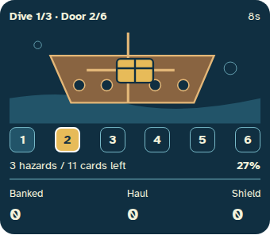

Setup and results

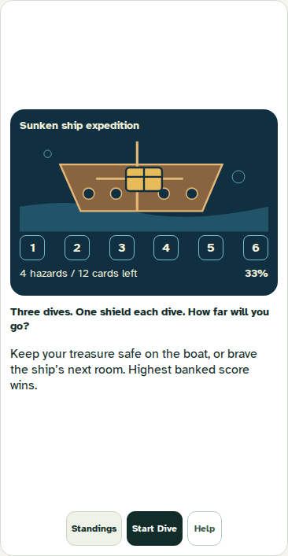

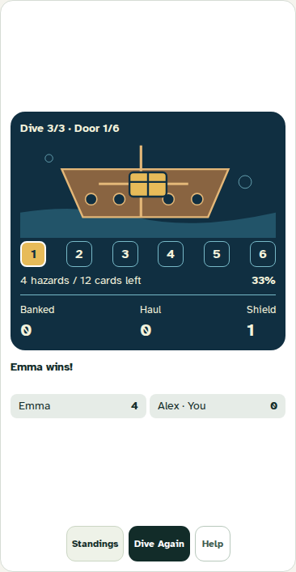

## Patchwork Picnic

Placement · phone layout.

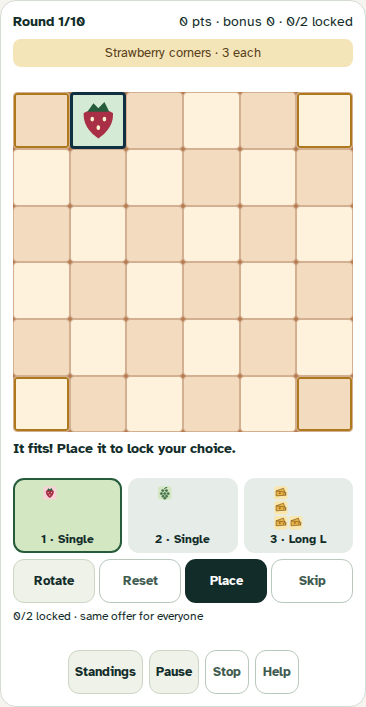

Setup and results

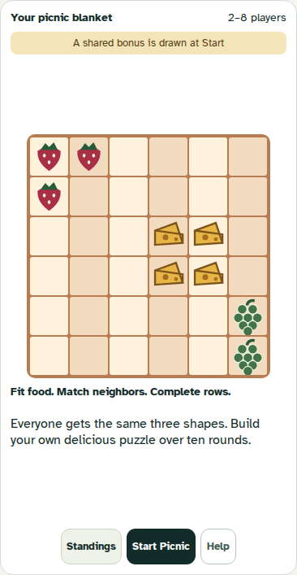

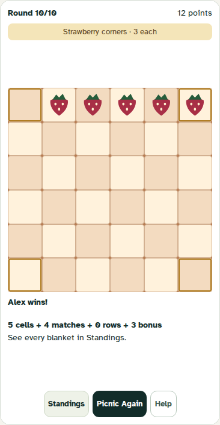

## Light Seek

Active board · phone layout.

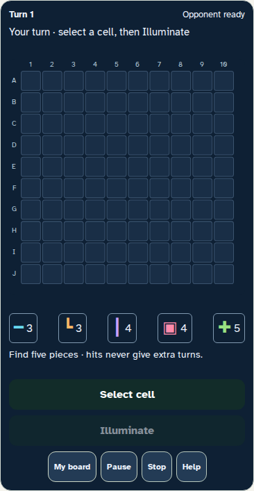

Found piece and results

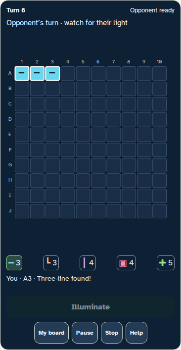

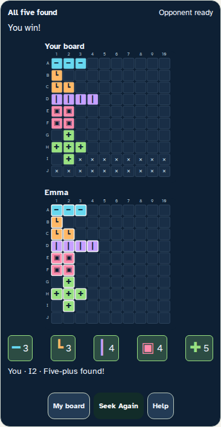

## Glow Clash

Round rewards · phone layout.

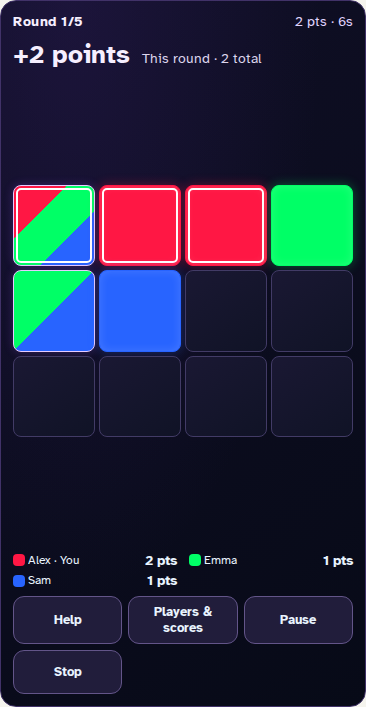

Secret choices and eight-player results

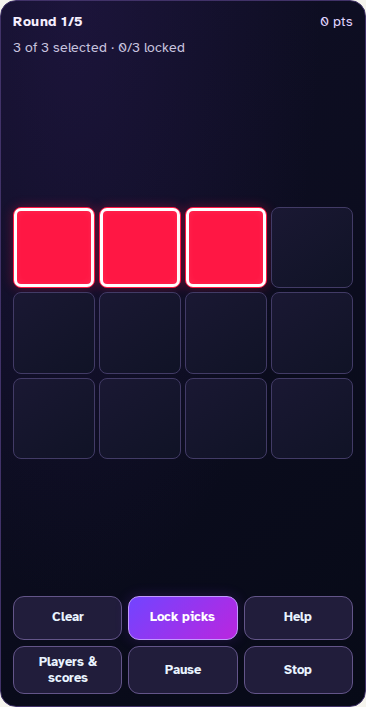

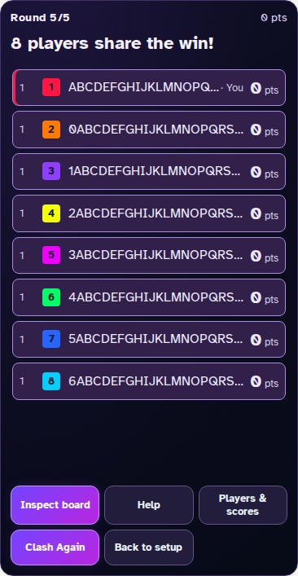

[All Glow Clash states](tests/glow.spec.ts-snapshots/)
